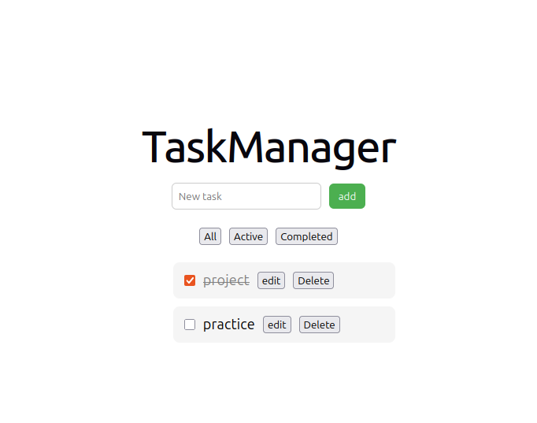
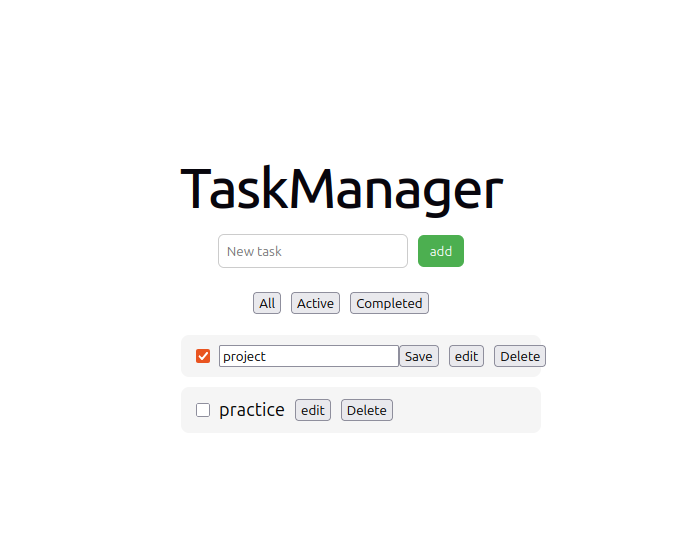
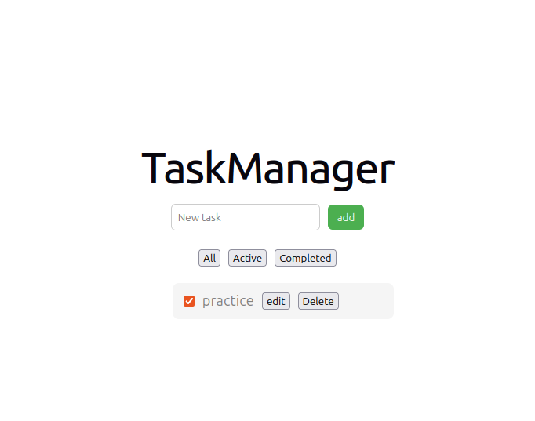

# Fullstack Task Manager

## Description
A fullstack task management
application that allows users to create, update, delete and filter tasks.
Built with React (frontend) and Spring Boot (backend), with PostgreSQL for data persistence.

## Screenshots 




A fullstack task manager built using React and Spring Boot.

## Tech Stack

Frontend: React

Backend: Spring Boot

Database: PostgreSQL

Container: Docker

## Key Features

- Create new tasks
- Mark tasks as completed
- Edit existing tasks
- Delete tasks
- Filter tasks (All, Active, Completed)
- Real-time updates via REST API

## Requirements
- Node.js
- Java 17 or higher
- Maven
- Docker (optional)
- PostgreSQL


## Database Setup
Make sure PostgreSQL is running.

Update your `application.roperties`:


## Run Backend

```bash
./mvnw spring-boot:run
```

backend runs on:

http://localhost:8080


## Run Frontend 

```bash
npm install
npm run dev
```

Frontend runs on:

http://localhost:5174

## Format API Endpoints properly

| Method | Endpoint     | Discription   |
|--------|--------------|---------------|
| GET    | /tasks       | Get all tasks |
| POST   | /tasks       | Create task   |
| PUT    | /tasks/{id}  | Update task   |
| DELETE | /tasks/{id}  | Delete task   |

## Example Request

POST /tasks

```json
{
"title: "Learn React",
"completed: false
}

```


## Future Improvements

- Add authentication (login/signup)
-Add due dates for tasks
-Add search functionality
- Improve UI/UX design

## Author
Natasha Roetz

Github:
https://github.com/natasharoetz13
