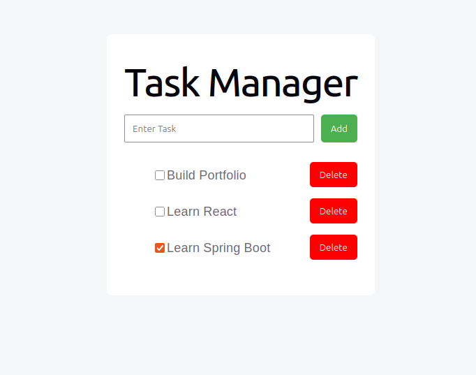

# Fullstack Task Manager

## Screenshot 


A fullstack task manager built using React and Spring Boot.

## Tech Stack

Frontend: React

Backend: Spring Boot

Database: PostgreSQL

Container: Docker

## Features

- Add tasks
- Mark tasks completed
- Delete tasks

## Run Backend

```bash
./mvnw spring-boot:run
```

backend runs on:

http://localhost:8080


## Run Frontend 

```bash
npm install
npm run dev
```

Frontend runs on:

http://localhost:5173

## Format API Endpoints properly

| Method | Endpoint |
|--------| ------ |
| GET    | /tasks |
| POST | /tasks |
| PUT | /tasks/{id} |
| DELETE | /tasks/{id} |


